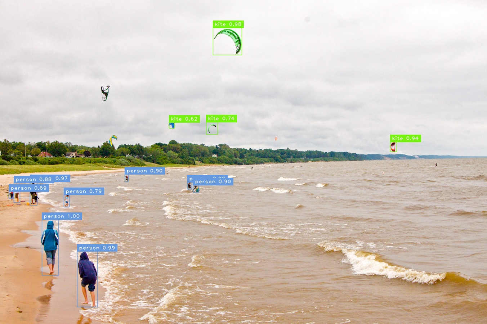
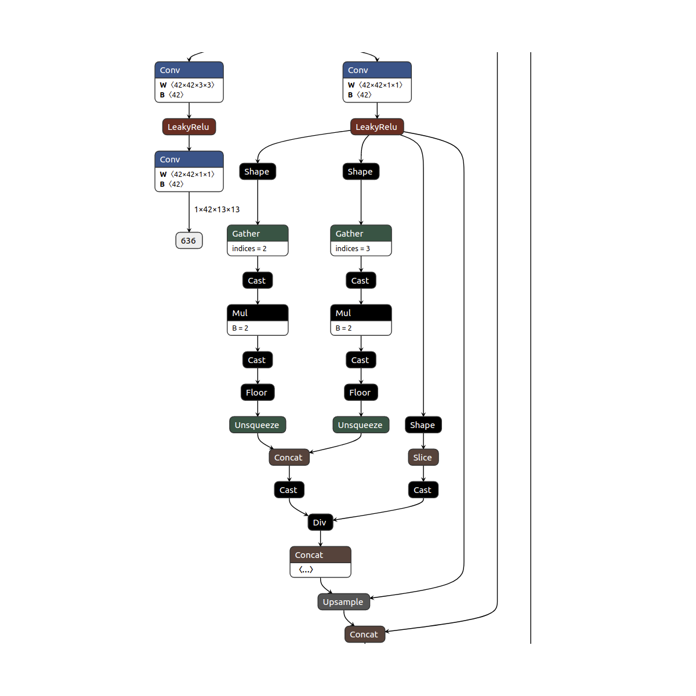
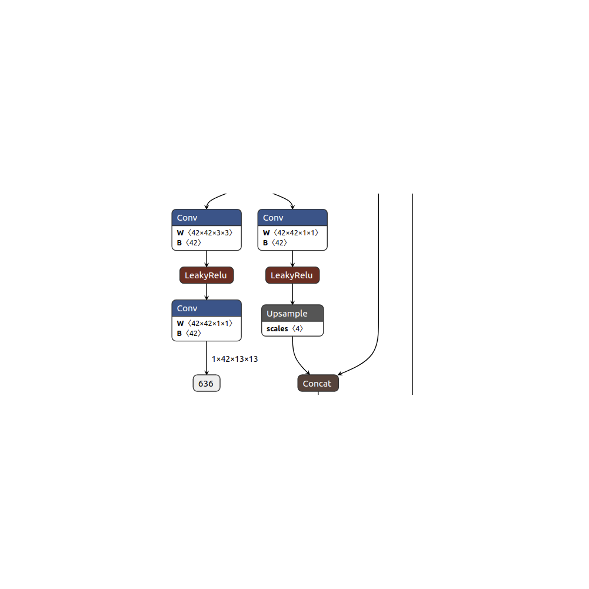
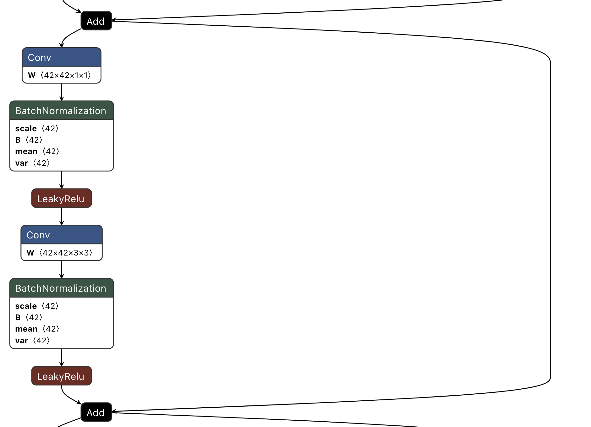
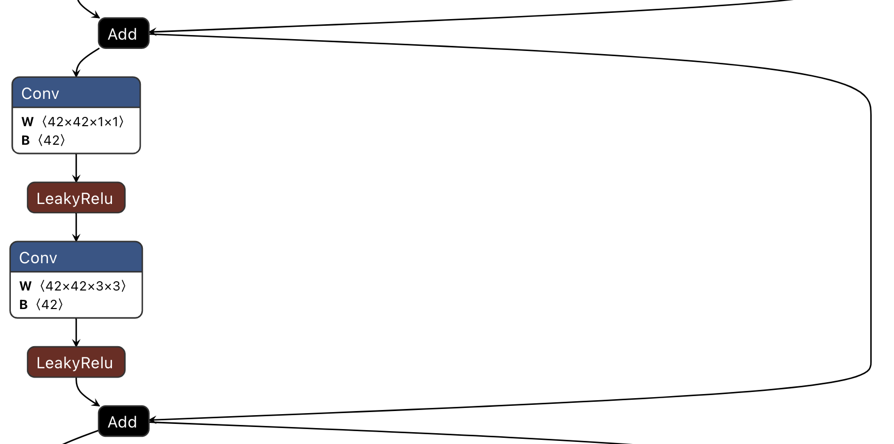
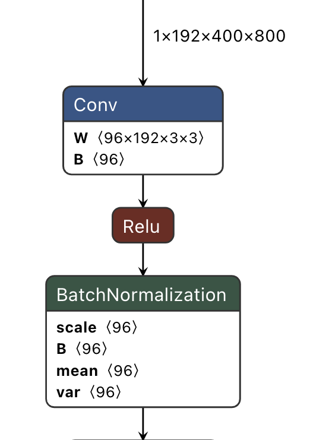
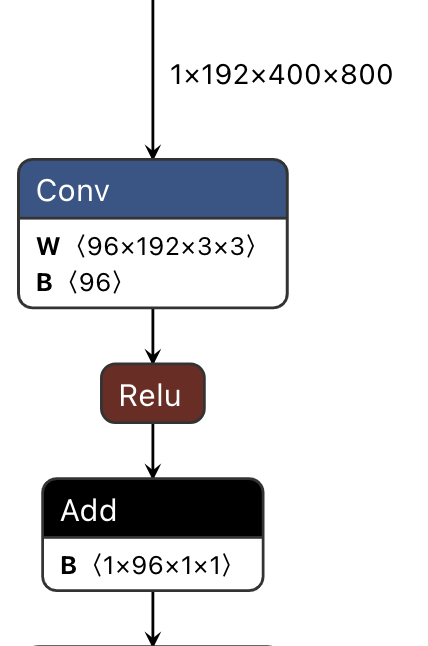

# Flex-Logix uses ONNX2Keras repository to convert ONNX models to TFLite

ONNX to Keras deep neural network converter. 

[](https://opensource.org/licenses/MIT)
[](https://github.com/gmalivenko/onnx2keras)
[](https://pepy.tech/project/onnx2keras)


## Requirements

Check the requirement.txt and install required libraries in a new virtual environment.

## API

`onnx_to_keras(onnx_model, input_names, input_shapes=None, name_policy=None, verbose=True, change_ordering=True) -> {Keras model}`

`onnx_model`: ONNX model to convert

`input_names`: list with graph input names

`input_shapes`: override input shapes (experimental)

`name_policy`: ['renumerate', 'short', 'default'] override layer names (experimental)

`verbose`: detailed output

`change_ordering:` change ordering to HWC (experimental)


## Getting started
### Conda (Recommended)

Create a conda environment called _flex-logix_ with all dependencies. This command prepare the environment for Flex-Logix scripts. 
```commandline
conda env create -f flex-logix.yml
conda activate flex-logix
```
# Two path to quantize models trained on DarkNet:
### 1. Quantization directly from DarkNet 


In case you prefer to quantize your model without conversion to ONNX you need to follow next steps:
1. Put your trained .weight model in cfg directory.
2. Open 'weightToTFlite.py' and change the following variables based on your model and data.
```python
    # The following line of code will define input image size
    in_size = 608
    # Choose how many images you want to use for quantization.
    Number_of_Quantization_data = 100
    # The following line define .weight models name which is saved within the model directory
    model_name = 'yolov3'
    # The following variable need to change to refer to the directory which training images are saved
    quantizationDataPath = './QuantizationData/*.jpg'
```
3. Next step is to evaluate the output. To do that using our Model head, please run 'weight_evaluation.py'. 
Open weight_evaluation.py and change following lines within the code:
```python
    # The following line define .tflite model name which is saved within the model directory
    model_name = 'yolov3_from_weight'
    # The following line define what head we want to use
    typeOfHead = 'yolov3'
    # The following variable need to change to refer to the directory which testing images are saved
    testing_directory = '/home/Ali/data/samples/*.jpg'
    # Change Confidence Threshold based on your preference
    Confidence_Threshold = 0.5
    # Change Intersection Over Union (IOU) Threshold based on your preference
    Intersection_Over_Union_threshold = 0.5
```
4. Following previous steps, a new folder would be generated and output images would be saved for further evaluations.
After following previous steps you should get an image similar to the following image.



This code is for YOLOv3 trained model with 80 classes. If you want to change the number of classes, you need to change 
following lines in the .cfg file:
1. Change classes=80 to classes=X (X is the number of classes you have). There are three lines that need to be changed.
2. Change filters=255 to filters=(X+5)*3 (For example if you have 1 class, you need to change filters to (1+5)*3->18).
3. Edit change.json by changing "labels": [] and "colors": [].
### Notes
In case you want to put your cfg file as the config file and dont want to modify existed cfg file, please pay attention 
to the anchors spaces. 
### 2. Quantization through ONNX 
Steps to work with YOLOv3 Model:
1. First you need to put your Complete ONNX model into the model directory.
2. Next step is to read the model and separate YOLOv3-backbone from the YOlOv3-output-head (ModelSurgery.py). Following 
lines of the python script need to be changed based on your model. 
```python
# Choose the name of the ONNX model
onnx_path = "./model/yolov3"
# Next step is a little bit tricky. We got the best experience by using the Netron tool. Using this tool we can take a look at layers which belongs to the head and include them in the NodesToIgnore array.

# Operators to ignore
NodesToIgnore = ['660']
NodesToIgnore.extend(list(range(636, 659)))
NodesToIgnore.extend(list(range(689, 712)))
NodesToIgnore.extend(list(range(742, 765)))

# The following line define new outputs for the Backbone model and new inputs for the models head 
NewOutputNodes = ['636', '689', '742']

```
3. Previous script generates two new ONNX files 'yolov3_backbone.onnx' and 'yolov3_OutputHead.onnx'. 
Next step is to validate if cutting is done correctly using YOLOv3ValidationStitching.py. You need to only change the 
following line of the code which is related to the input image size.
```python 
XY_Dim = 608 
``` 
You should get output like this:
```python
Max Error Between Cutting/Stitching YOLO Head to its Backbone and original model output 815: 0.0
MSE Between Cutting/Stitching YOLO Head to its Backbone and original model output 815: 0.0
Max Error Between Cutting/Stitching YOLO Head to its Backbone and original model output 662: 0.0
MSE Between Cutting/Stitching YOLO Head to its Backbone and original model output 662: 0.0
Error Between Cutting/Stitching YOLO Head to its Backbone and original model output 738: 0.0
MSE Between Cutting/Stitching YOLO Head to its Backbone and original model output 738: 0.0
Error Between Cutting/Stitching YOLO Head to its Backbone and original model output 814: 0.0
MSE Between Cutting/Stitching YOLO Head to its Backbone and original model output 814: 0.0
```
which shows Maximum error and Mean Square Error between Original ONNX model you loaded vs 
the model head stitched to the backbone of the ONNX model created through Flex-Logix flow. 
This Script shows our flow is perfect for cutting.

4. Optimize the model and try to fold BatchNormalization (Optimization.py). 
This python script fold Batch Normalization operators. It generates an output called 'yolov3_backbone_OPT.onnx'.

5. This step is only required for models which the operator _Upsample_ is replaced with multiple operators. 
Since some '.weight' to 'ONNX' scripts replace **upsample** with **several operators**, we need to put upsample back  
and check the result to make sure model's result does not change. To do this, after cutting the output 
layers from the model and running optimization to fold batch normalization, we need to run two python 
scripts:

I. OperatorReplacement.py which replace operators in the following figure with Upsampling





II. Validation.py which compare two models with each other to make sure their results are same (Generated output for a 
random input must be zero).

III. At this point the model is ready to get quantized so we can get back to the instructions provided before


5. Convert and quantized the backbone model from ONNX to TFLite using 'ConvertingONNX2_Q_NoQ_TFLite.py'
```python
# Name of the model to convert and quantized
ModelName = "./model/yolov3_backbone_OPT"
# Name of the input from the first layer. You can use Netron to check the name for your model.
ModelInputLayerName = 'input.1'
# Input size for your model
in_size = 608
# Path to quantization data
quantizationDataPath = './QuantizationData/*.jpg'
# Number of input data required for quantization
Number_of_Quantization_data = 1
# This option need to be true remove Transpose operators which are used from ONNX to tflite
ordering = True
```
6. Check if the Optimized-ONNX-Model is correctly converted to TFLite. Using ONNX you would have two options to evaluate 
your tflite model. Approach 1 is to use our script for head (weight_evaluation.py) as explained before. Second approach 
is to connect the head of the model cut before and use NMS script to draw boxes. Please use 'tfliteBackbone_ONNXHead_evaluation.py' 
to achieve this goal.

# Batch Normalization After Foldable Operator

BatchNormalization operator are operators cannot be run optimally on Accelerators.They are usually folded into other operators around them. Here two examples are provided for your consideration. In the first example Batch Normalization operators come after 2D-Convolution. We need to optimize the model by folding them into the 2D-Convolution. Following two pictures demonstrate how we do that. You can run 'BeforeBN.py' to optimize the model. 

### Before Optimization



### After Optimization



### BN After Unfoldable Operator

### Before Optimization



### After Optimization



##FAQ
####How many images are required to get the best quantization result?

    It can vary from 1 to 1000. It depends on the model and data, but usually the more images you have the better 
    the quantization would be.

####What if I can't get good enough result?

    You need to check pre-processing and post-processing steps in 'weightToTFlite.py'. For pre-processing 
    step you need to change lines from 28-37 within the python script.

####What if I don't want to use the head provided by Flex-Logix?

    In this case you need to follow the ONNX approach which cut the head from your model and attach 
    that part back to your model

####What repository Flex-Logix used to convert YOLOV3 weight to ONNX?

    Flex-Logix used the following repository

#### Why do we need to cut the head from the trained model?

    The YOLO head is not included because TFLite does not support custom layers yet; therefore, we'll need to cut and 
    then implement the YOLO head ourselves.


## License
This software is covered by MIT License.
